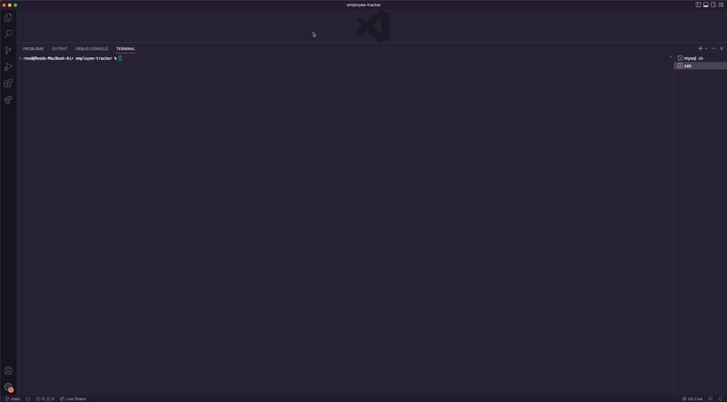

# Employee Tracker

## Description

The Employee Tracker application allows a user to review their employee structure through a command line interface using an SQL database. Users can view or add employees, departments, and roles, as well as update an existing employee's role to one that is in the org structure. 

In developing this application I learned a lot about how to integrate SQL databases into applications and how to work on them with prepared statements in JavaScript.

## Installation

In order to work on or use this code you will need to clone the repo down to your machine and install all packages. Then to run it enter into you command line: "npm start". Be sure to source in the schema.sql file before you run the program and you may also want to source in the seeds.sql file as well so there is some data to work with preloaded.

## Usage

Once live, a user can review/create new roles, departments, and employees through main menu prompts in the command line. For a full demo see the gif below or click the link to see the video walkthrough of the app. 
- Walkthrough link: https://drive.google.com/file/d/1nOSF49tnjoxEKpdBbQ41QL_9DNTfbQ_L/view?usp=share_link

   

## Credits

Packages used in this application: 
- MySQL2 
- Inquirer
- cTable

